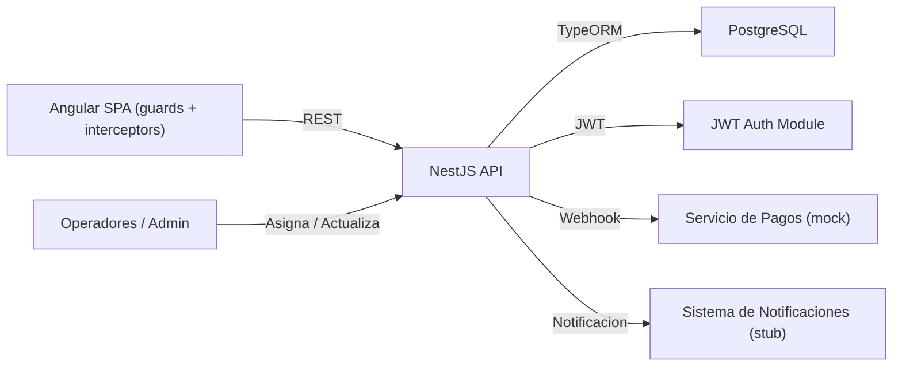
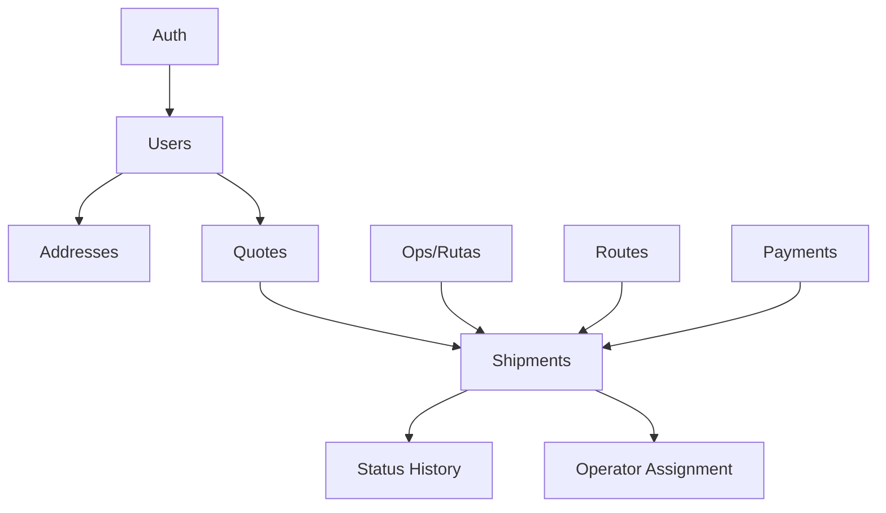
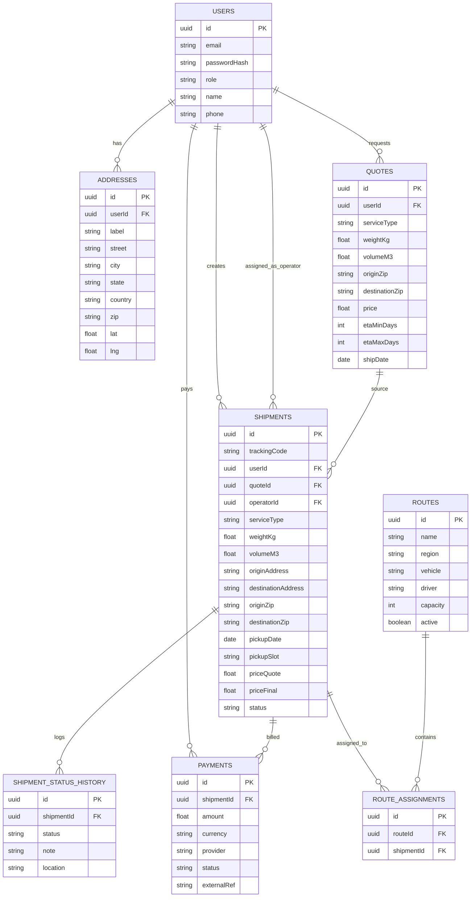
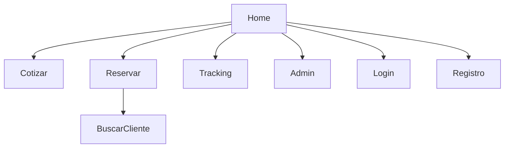
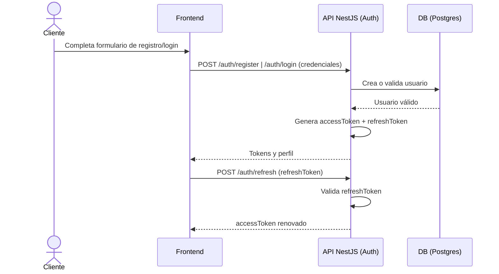
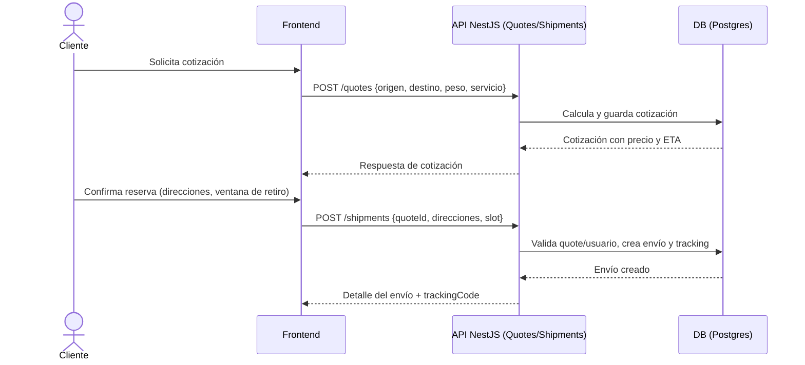
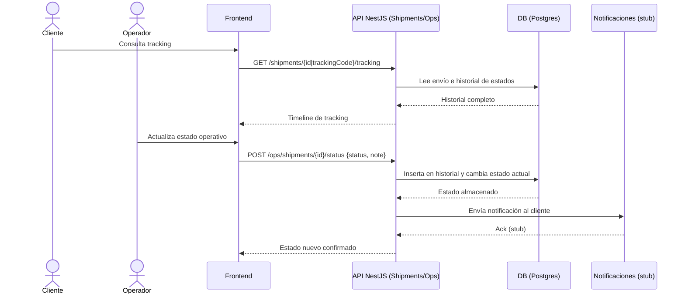
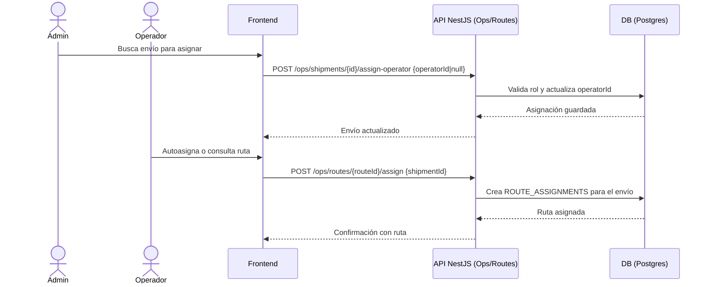
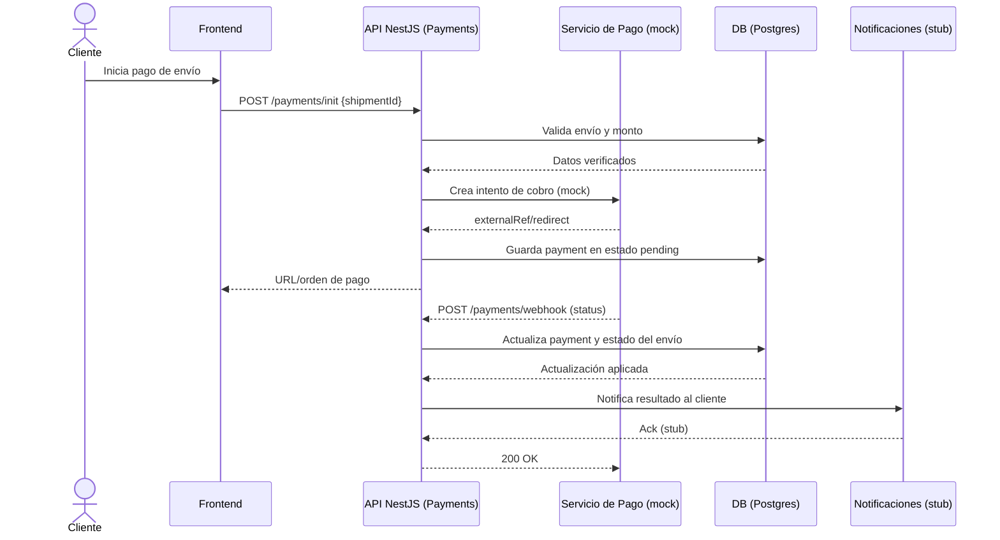

# Sistema Web de Transporte de Paquetes con Reservas

Stack académico: **NestJS 11**, **Angular 20**, **PostgreSQL 16**, dockerizado por capas.

## Requisitos
- Docker y docker-compose
- Puertos libres: `5432` (DB), `3000` (API), `4200` (Frontend)

## Variables de entorno y configuración
Plantillas:
- `cp .env.example .env`
- `cp backend/.env.example backend/.env` (local)
- `cp backend/.env.docker backend/.env.docker` (compose principal, usa host `db`)
- `cp frontend/.env.example frontend/.env`
- `cp db/.env.example db/.env` (principal)
- `cp db/.env.test.example db/.env.test` (pruebas)

Claves por capa:
- Backend (`backend/.env`): `PORT`, `DB_HOST`, `DB_PORT`, `DB_USER`, `DB_PASS`, `DB_NAME`, `JWT_SECRET`  
  - Docker: `DB_HOST=db` con `.env.docker`. Local: `DB_HOST=localhost`.
- Frontend (`frontend/.env`): `API_URL`, `FRONTEND_PORT`
- BD (`db/.env`): `POSTGRES_DB`, `POSTGRES_USER`, `POSTGRES_PASSWORD`, `DB_PORT`
- Root opcional (`.env`): `BACKEND_PORT`, `FRONTEND_PORT`, `DB_PORT`

## Arquitectura (Mermaid)


Backend módulos:


Diagrama entidad-relación (simplificado):


Frontend páginas:


## Ejecución con Docker
```bash
docker compose up --build
```
Servicios:
- Frontend: http://localhost:4200
- Backend: http://localhost:3000
- Postgres: localhost:5432 (USER/PASS: parcels, DB `parcels` creada por `init-db.sql`). El backend espera a DB healthy.

Detener: `docker compose down` (agrega `-v` para borrar volumen `db-data`).

## Makefile (atalhos)
- `make up` / `make down` / `make clean` (down -v)
- `make build` (build de imágenes)
- `make logs` (todos) o `backend-logs` / `frontend-logs` / `db-logs`
- `make ps` (estado de contenedores)

## Desarrollo local (sin Docker)
Backend:
```bash
cd backend
npm install
npm run migration:run   # aplica migraciones usando .env
npm run start:dev
```
Frontend:
```bash
cd frontend
npm install
npm start
```
Ajusta `frontend/.env` (API_URL) si el backend corre en otro host/puerto.

## API (REST) principales
Base: `http://localhost:3000`
- Auth: `POST /auth/register`, `POST /auth/login`, `POST /auth/refresh`
- Perfil: `GET /users/me` (Bearer), direcciones CRUD `/users/me/addresses`
- Búsqueda de usuarios: `GET /users/search?q=term&role=client|operator`
- Cotizar: `POST /quotes` body `{ originZip, destinationZip, weightKg, volumeM3, serviceType, shipDate?, userId? }` (si hay token, se asocia al usuario)
- Envío/reserva: `POST /shipments` body `{ quoteId, originAddress, destinationAddress, originZip, destinationZip, weightKg?, volumeM3?, serviceType?, pickupDate, pickupSlot, priceQuote?, priceFinal?, userId? }` (requiere `quoteId`; si la quote tiene dueño, se fuerza ese `userId`)
- Listar envíos: `GET /shipments` filtros `me=true` (token), `status`, `routeId`, `dateFrom`, `dateTo`
- Detalle: `GET /shipments/{id}`; Tracking: `GET /shipments/{id}/tracking`
- Operador/Admin: `GET /ops/shipments` (filtros), `POST /ops/shipments/{id}/status`
- Asignar operador: `POST /ops/shipments/{id}/assign-operator` body `{ operatorId }` (admin puede asignar cualquiera; operador puede autoasignarse)
- Rutas: `POST /ops/routes`, `POST /ops/routes/{routeId}/assign`, `GET /ops/routes/{routeId}/assignments`
- Pagos: `POST /payments/init`, `POST /payments/webhook`, `GET /payments/{id}`

Tokens: login/registro devuelven `accessToken` (Bearer) y `refreshToken`.

Flujo core (cotización → reserva → tracking → asignación):
1) `POST /quotes` genera una cotización con precio/ETA.
2) `POST /shipments` requiere `quoteId` y datos de direcciones/ventana; genera tracking, fuerza el `userId` de la cotización.
3) `GET /shipments/{id o trackingCode}/tracking` muestra historial; operadores/admin actualizan estado.
4) `POST /ops/shipments/{id}/assign-operator` asigna operador (admin) o autoasigna (operador); enviar `operatorId=null` desasigna.

## Diagramas de secuencia de procesos
Los diagramas usan los endpoints REST definidos arriba y los módulos indicados en la arquitectura.

### Autenticación (registro, login y refresh)


### Cotización y creación de envío


### Tracking y actualización de estados


### Asignación de operador y rutas


### Pago y webhook


Datos seed (migración)
- 5 usuarios clientes `user1@demo.com` a `user5@demo.com` con contraseña `password123`.
- 5 envíos de ejemplo con tracking `PKG-SEED-00X` asociados a esos usuarios.
- Usuarios operativos: `operator@demo.com` (rol operador) y `admin@demo.com` (rol admin), contraseña `password123`.
- Historial de envíos seed: estados precargados en `shipment_status_history` (creado, en tránsito, entregado, etc. según cada tracking).
- Cotizaciones seed: 5 cotizaciones express/standard/economic demo.
- Direcciones seed: casa y oficina para cada usuario demo.

## Frontend (Angular)
- Páginas: Cotizar, Reservar (buscador de clientes; clientes bloqueados a su usuario), Tracking (incluye lista de “Mis envíos” para usuarios logueados), Operador (tabla de envíos con detalle y asignación de operador/autoasignación), Login/Registro; Inicio/Operador solo visibles para roles operator/admin.
- Estado de sesión con `AuthService` y `AuthInterceptor` (JWT, manejo de 401/403); `LoggingInterceptor` en dev; guardas protegen todas las vistas.

## Estructura
- `backend/`: NestJS + TypeORM, migraciones en `src/migrations`, módulos Auth, Users, Quotes, Shipments/Ops, Routes, Payments, Notifications.
- `frontend/`: Angular standalone components en `src/app/pages`, servicios en `src/app/services`.
- `db/`: compose de Postgres con `init-db.sql` que crea `parcels` y `parcels_test`.
- `docker-compose.yml`: orquestación principal (db/backend/frontend).

## Pruebas automatizadas
### Backend (NestJS + Jest)
- Comandos: `cd backend && npm test` (unit + e2e) o `npm run test:coverage` (reporte en `backend/coverage`).
- Configuración: `jest.config.ts` con `ts-jest`, mapeo `src/*` y SQLite en memoria (`test/test-datasource.ts` y módulos de prueba) para no depender de Postgres; `JWT_SECRET` se inyecta en los tests.
- Casos cubiertos:
  - Auth (`test/auth.service.spec.ts`): registro devuelve payload saneado y tokens, rechaza email duplicado, login válido/inválido y refresh válido/inválido.
  - Quotes (`test/quotes.service.spec.ts`): cálculo de precio por peso volumétrico y recuperación por id.
  - Shipments (`test/shipments.service.spec.ts`): requiere quote existente y dueño correcto, genera tracking + historial inicial, agrega estados notificando, bloquea operadores no asignados, asigna/desasigna operadores.
  - E2E API (`test/app.e2e-spec.ts`): flujo completo registro → cotizar → crear envío → tracking → asignar operador → actualizar estado, y verificación de guard JWT en rutas de operador.

### Frontend (Angular + Karma/Playwright)
- Unit tests: `cd frontend && npm test` usa Karma con `ChromeHeadless` (`karma.conf.js`), cobertura en `frontend/coverage`.
- Casos: guard de auth e interceptor validan sesión/redirección; componentes `Quote`, `Reserve`, `Login`, `Tracking` y `AdminDashboard` validan envío de formularios, bloqueo de usuario cliente, búsqueda de usuarios, creación de reservas, consultas de tracking, actualizaciones de estado y asignaciones (admin/autoasignación).
- E2E UI: `npm run e2e` ejecuta Playwright (`playwright.config.ts`), `E2E_BASE_URL` opcional (por defecto `http://localhost:4200`). El flujo `e2e/shipment-flow.spec.ts` maqueta las peticiones REST y recorre login → cotizar → reservar → tracking → panel operador/admin.

## Notas
- Migraciones activadas (`migrationsRun=true`); `synchronize` desactivado.
- Compose principal usa `backend/.env.docker` y healthcheck en DB para evitar `ECONNREFUSED`.
